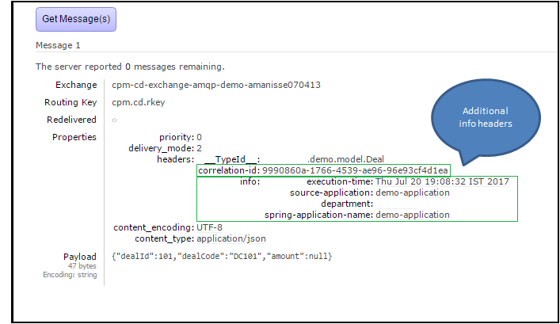
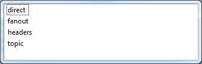
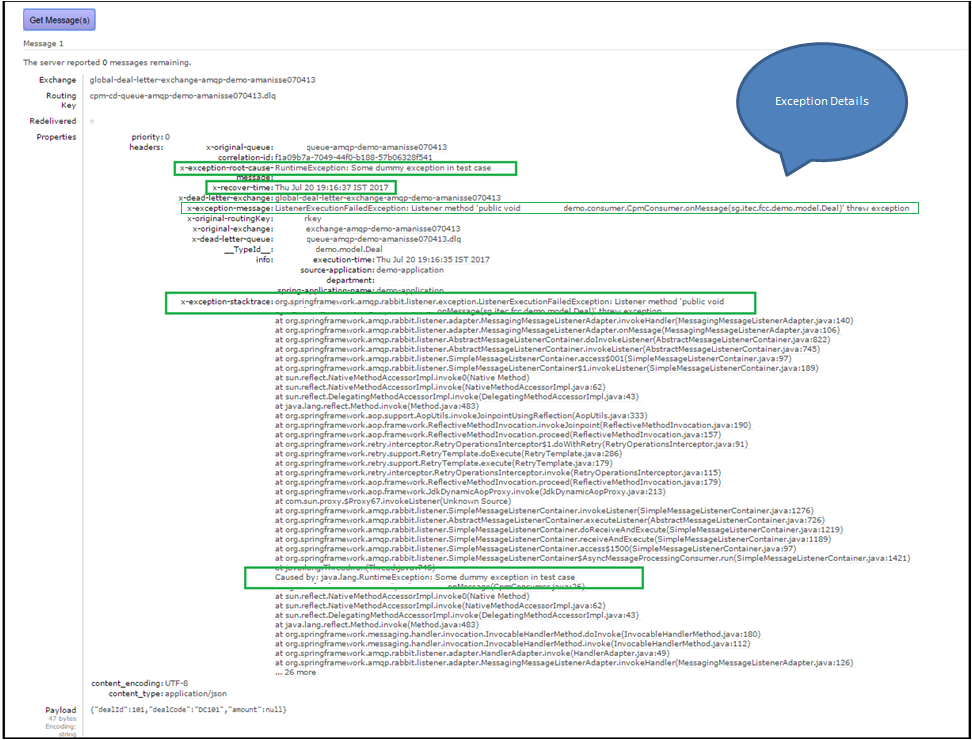
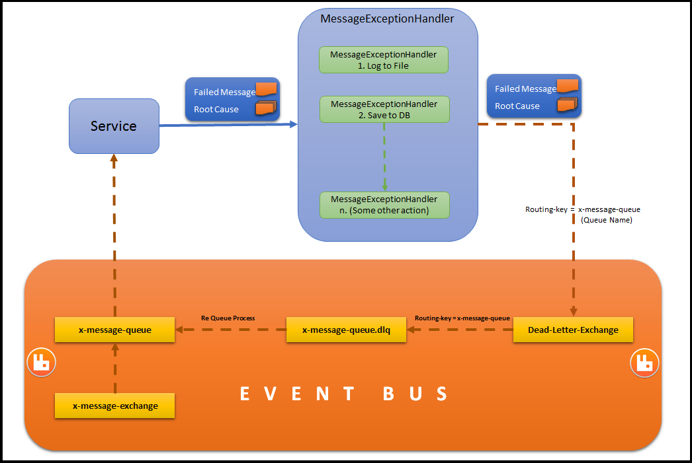
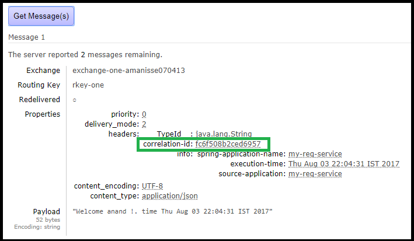
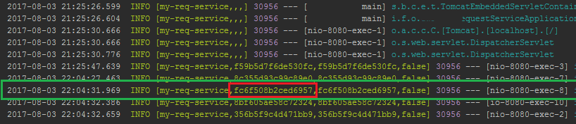

# rabbitmq-advanced

A generic library for messaging with rabbit mq with extension on spring boot amqp


[](https://travis-ci.org/societe-generale/rabbitmq-advanced-spring-boot-starter)

- [Aim](#aim)
- [Configurations](#configurations)
  - [Pom Configuration](#pom-configuration)
  - [Spring RabbitMQ Configuration](#spring-rabbitmq-configuration)
  - [RabbitMQ Auto Configuration](#rabbitmq-auto-configuration) 
  - [Info Headers Configuration](#info-headers-configuration)
  - [Default Exchange Configuration](#default-exchange-configuration)
  - [Default Queue Configuration](#default-queue-configuration)
  - [Dead Letter Configuration](#dead-letter-configuration)
  - [ReQueue Configuration](#requeue-configuration)
  - [Exchange Configuration](#exchange-configuration)
  - [Queue Configuration](#queue-configuration)
  - [Binding Configuration](#binding-configuration)
- [Exception Handling](#exception-handling)
- [Correlation Id](#correlation-id)
- [Contributions](#contributions)
- [License](#license)

## Aim
The aim of this project is to provide a generic spring boot starter project for messaging solution with rabbit mq.
This help us to auto configure rabbit mq exchange and queue along with the binding by simply providing the configurations in yml.
This also helps in better exception handling and monitoring at a single place at a framework level.
Hence no more duplicate code added for creating exchange and queue with the binding in various projects

## Configurations
```
You can configure rabbit mq server configurations in application.yml under 'spring.rabbitmq' section.
You can configure the exchange , queue, binding in application.yml under 'rabbitmq.auto-config'.
```

### Pom Configuration
Please add below pom dependency for rabbitmq-advanced-spring-boot-starter
```xml
    <dependency>
        <groupId>com.societegenerale</groupId>
        <artifactId>rabbitmq-advanced-spring-boot-starter</artifactId>
        <version>1.0.0.RELEASE</version> 
        <!-- check the latest version -->
    </dependency>
```

### Spring RabbitMQ Configuration
`Below is the sample spring rabbitmq configuration.`

```yaml
spring:
  rabbitmq:
    addresses: <server>
    username: <username>
    password: <password>
    virtual-host: <v-host>
    ssl:
      enabled: false
    listener:
      default-requeue-rejected: false
      retry:
        enabled: true
      acknowledge-mode: auto
```

### RabbitMQ Auto Configuration
```
Below is the sample rabbitmq auto configuration.
```
```yaml
rabbitmq:
  auto-config:
    #enable or disable auto configuration. Default is true
    enabled: true
    
    #Info Headers can be used to add additional information to be added in each message headers
    info-headers:
      source-application: ${spring.application.name}
      
    #Exchange configuration at default level, will be applied to all the missing configuration of each Exchange.  This can be overridden by configuring at each exchange level.  
    default-exchange:
      type: topic
      durable: false
      auto-delete: true
    
    #Queue configuration at default level, will be applied to all the missing configuration of each Queue.  This can be overridden by configuring at each queue level.
    default-queue:
      durable: false
      auto-delete: true
      dead-letter-enabled: true
    
    #Dead Letter Configuration to configure dead letter exchange and queue postfix.
    dead-letter-config:
      dead-letter-exchange:
        name: my-app-dead-letter-exchange-${user.name}
        auto-delete: true
        durable: false
      queue-postfix: .dlq
    
    #Re Queue Configuration to configure the requeue exchange and queue.
    re-queue-config:
      enabled: true
      exchange:
        name: re-queue-exchange-${user.name}
      queue:
        name: re-queue-queue-${user.name}
      routing-key: requeue.key
          
    #You can configure all your exchanges here  
    exchanges:
      exchange-one:
        name: exchange-one-${user.name}
      exchange-two:
        name: exchange-two-${user.name}
      exchange-mock:
        name: exchange-mock-${user.name}
    
    #You can configure all your queue here
    queues:
      queue-one:
        name: queue-one-${user.name}
      queue-two:
        name: queue-two-${user.name}
      queue-mock:
        name: queue-mock-${user.name}
        dead-letter-enabled: false
    
    #You can configure your bindings for the exchanges and queues here    
    bindings:
      binding-one:
        exchange: exchange-one
        queue: queue-one
        routing-key: rkey-one
      binding-two:
        exchange: exchange-two
        queue: queue-two
        routing-key: rkey-two
      binding-mock:
        exchange: exchange-mock
        queue: queue-mock
        routing-key: rkey-mock
        
        
```


### Info Headers Configuration

```
You can configure the info headers here. All these header info will be added to the each messages sent by the system. 
```
```yaml
rabbitmq:
  auto-config:
  . . .
    #Info Headers can be used to add additional information to be added in each message headers
    info-headers:
      source-application: my-demo-application
      department: company/my-department
  . . .      
```



### Default Exchange Configuration

```
You can configure the default exchange under this section. All the common properties can be con configured here.
At each exchange level you can override the default configuration. All the missing properties will be mapped with default configurations 
``` 
```yaml
rabbitmq:
  auto-config:   
  . . .     
    #Exchange configuration at default level, will be applied to all the missing configuration of each Exchange.  This can be overridden by configuring at each exchange level.  
    default-exchange:
      type: topic
      durable: false
      auto-delete: true
  . . .      
```

  1. **type**         : `This indicate the type of the exchange.`

      `The available parsers are : `
      1. **topic**   : `This is for 'topic exchange' and this is the default type.`
      2. **direct**  : `This is for 'direct exchange'.`
      3. **fanout**  : `This is for 'fanout exchange'.`
      4. **headers** : `This is for 'headers exchange'.`


  2. **durable**      : `This indicate the  exchange is durable or not (Boolean)`

  3. **auto-delete**  : `This indicate the  exchange auto-delete enable or not (Boolean)`

  4. **delayed**      : `This indicate the  exchange delayed enable or not (Boolean)`

  5. **internal**     : `This indicate the  exchange internal enable or not (Boolean)`

  6. **arguments**    : `This indicate the  exchange arguments to be added (Map)`


### Default Queue Configuration

```
You can configure the default queue under this section. All the common properties can be con configured here.
At each queue level you can override the default configuration. All the missing properties will be mapped with default configurations 
``` 

```yaml
rabbitmq:
  auto-config:   
  . . .         
    #Queue configuration at default level, will be applied to all the missing configuration of each Queue.  This can be overridden by configuring at each queue level.
    default-queue:
      durable: false
      auto-delete: true
      dead-letter-enabled: true
  . . .            
```

  1. **durable**              : `This indicate the  queue is durable or not (Boolean)`

  2. **auto-delete**          : `This indicate the  queue auto-delete enable or not (Boolean)`

  3. **dead-letter-enabled**  : `This indicate whether dead-letter-queue need to auto configure or not (Boolean)`

  4. **exclusive**            : `This indicate the  queue exclusive enable or not (Boolean)`

  5. **arguments**            : `This indicate the  queue arguments to be added (Map)`


### Dead Letter Configuration

```
You can configure the dead letter exchange and queue postfix. Then all you have to do is for queue , enable the dead letter queue.
The dead letter queue will be created with the same name as original queue with dead letter queue postfix.
Queue : my-process-queueu
Dead Letter Queue : my-process-queueu.dlq 
```
```yaml
rabbitmq:
  auto-config:   
  . . .         
    #Dead Letter Configuration to configure dead letter exchange and queue postfix.
    dead-letter-config:
      dead-letter-exchange:
        name: my-app-dead-letter-exchange-amqp-test-${user.name}
        auto-delete: true
        durable: false
      queue-postfix: .dlq
  . . .               
```

```yaml
rabbitmq:
  auto-config:
  . . .      
    queues:
      queue-one:
        name: queue-one
        dead-letter-enabled: false
  . . .              
```

  1. **type**        : `This indicate the type of the dead letter exchange.`

      

      `The available parsers are : `
      1. **topic**   : `This is for 'topic exchange' and this is the default type.`
      2. **direct**  : `This is for 'direct exchange'.`
      3. **fanout**  : `This is for 'fanout exchange'.`
      4. **headers** : `This is for 'headers exchange'.`


  2. **name**        : `This indicate the 'Name' of the dead letter exchange.`

  3. **durable**     : `This indicate the dead letter exchange is durable or not (Boolean)`

  4. **auto-delete** : `This indicate the dead letter exchange auto-delete enable or not (Boolean)`

  5. **delayed**     : `This indicate the dead letter exchange delayed enable or not (Boolean)`

  6. **internal**    : `This indicate the dead letter exchange internal enable or not (Boolean)`

  7. **arguments**   : `This indicate the dead letter exchange arguments to be added (Map)`


### ReQueue Configuration

```
You can configure the requeue exchange and queue here.
To requeue some message from any dead letter queue, you just have to push a requeue message to requeue exchange with requeue routing key. 
```

```yaml
rabbitmq:
  auto-config:   
  . . .         
    #Re Queue Configuration to configure the requeue exchange and queue.
    re-queue-config:
      enabled: true
      exchange:
        name: re-queue-exchange-${user.name}
      queue:
        name: re-queue-queue-${user.name}
      routing-key: requeue.key
  . . .               
```

  1. **enabled**      : `This is to enable or disable requeue`

  2. **exchange**     : `This indicate the 'exchange' configuration for requeue`

  3. **queue**        : `This indicate the 'queue' configuration for requeue`

  4. **routing-key**  : `This indicate the 'routing-key' configuration for requeue`

```
Below is the format for requeue message which requeue 3 message from 'some-queue.dlq' to 'some-queue' 
```

```json
{
  "deadLetterQueue" : "some-queue.dlq",
  "messageCount" : 3
}
```

### Exchange Configuration

```
You can configure all the exchanges under this section. (Map)
```

```yaml
rabbitmq:
  auto-config:   
  . . .         
    #You can configure all your exchanges here  
    exchanges:
      exchange-one:
        name: exchange-one-${user.name}
      exchange-two:
        name: exchange-two-${user.name}
      exchange-mock:
        name: exchange-mock-${user.name}
  . . .                 
```

  1. **type**        : `This indicate the type of the exchange.`

      

      `The available parsers are : `
      1. **topic**   : `This is for 'topic exchange' and this is the default type.`
      2. **direct**  : `This is for 'direct exchange'.`
      3. **fanout**  : `This is for 'fanout exchange'.`
      4. **headers** : `This is for 'headers exchange'.`


  2. **name**        : `This indicate the 'Name' of the exchange.`

  3. **durable**     : `This indicate the  exchange is durable or not (Boolean)`

  4. **auto-delete** : `This indicate the  exchange auto-delete enable or not (Boolean)`

  5. **delayed**     : `This indicate the  exchange delayed enable or not (Boolean)`

  6. **internal**    : `This indicate the  exchange internal enable or not (Boolean)`

  7. **arguments**   : `This indicate the  exchange arguments to be added (Map)`


### Queue Configuration
```
You can configure all the queues under this section. (Map)
```

```yaml
rabbitmq:
  auto-config:   
  . . .         
    #You can configure all your queue here
    queues:
      queue-one:
        name: queue-one-${user.name}
      queue-two:
        name: queue-two-${user.name}
      queue-mock:
        name: queue-mock-${user.name}
        dead-letter-enabled: false
  . . .                 
```
  1. **name**  : `This indicate the 'Name' of the queue.`

  2. **durable**  : `This indicate the  queue is durable or not (Boolean)`

  3. **auto-delete**  : `This indicate the  queue auto-delete enable or not (Boolean)`

  4. **dead-letter-enabled**  : `This indicate whether dead-letter-queue need to auto configure or not (Boolean)`

  5. **exclusive**  : `This indicate the  queue exclusive enable or not (Boolean)`

  6. **arguments**  : `This indicate the  queue arguments to be added (Map)`


### Binding Configuration
```
You can configure all the bindings under this section. (Map)
```

```yaml
rabbitmq:
  auto-config:   
  . . .         
    #You can configure your bindings for the exchanges and queues here    
    bindings:
      binding-one:
        exchange: exchange-one
        queue: queue-one
        routing-key: rkey-one
      binding-two:
        exchange: exchange-two
        queue: queue-two
        routing-key: rkey-two
      binding-mock:
        exchange: exchange-mock
        queue: queue-mock
        routing-key: rkey-mock
  . . .                 
```

  1. **exchange**    : `This indicate the exchange key which you want to bind with the given queue.`

  2. **queue**       : `This indicate the queue key which you want to bind with the given exchange.`

  3. **routing-key** : `This indicate the routing-key used to bind the given exchange and queue`

  4. **arguments**   : `This indicate the arguments to be added for the binding (Map)`


### Exception Handling

#### Enable Dead Letter Queue

You can enable dead letter queue for each queue by providing below configuration in respective queue configuration or at the default queue configuration

```yaml

rabbitmq: 
  auto-config:
   
   . . .
      
    #Dead Letter Configuration to configure dead letter exchange and queue postfix.
    dead-letter-config:
      dead-letter-exchange:
        name: my-app-dead-letter-exchange-amqp-test-${user.name}
        auto-delete: true
        durable: false
      queue-postfix: .dlq
  
  . . .  
        
    queues:
      some-queue: 
        ...
        dead-letter-enabled: true  #Enable Dead Letter Queue at individual queue level
        ...

  . . .  
```
With the above configuration , the failed message will be send to the dead letter queue which is bind to the dead letter exchange as per the configuration. 
Example : If the queue name is **'some.dummy.queue'** and dead-letter-queue-postfix is **'.dlq'** then dead letter queue will be **'some.dummy.queue.dlq'**



The above is the sample message in the dead letter queue. 

#### Message Exception Handler

In addition to the above dead letter queue, we can also configure MessageExceptionHandler's to have additional exception handling like saving the failed message exception to database, or doing additional logging etc.  
If you want to handle MessageException , you can implement the MessageExceptionHandler and configure the bean in spring.
Each message and the exception will be passed to all MessageExceptionHandler (if its configured)

You need to enable the retry to use the message exception handler
```yaml
spring:
  rabbitmq:
  ...
  ...
    listener:
      default-requeue-rejected: false
      retry:
        enabled: true
```



```java
    public interface MessageExceptionHandler {
      void handle(Message message, Throwable cause);
    } 
```

```java
    @Slf4j
    public class LogMessageExceptionHandler implements MessageExceptionHandler {
    
        @Override
        public void handle(Message message, Throwable cause) {
              Map<String, Object> headers = message.getMessageProperties().getHeaders();
              log.warn("Dead letter message from queue {{}} , message {{}} , headers {{}} :  cause",
              headers.get("x-original-queue"), getMessageString(message), headers, cause);
        }
        
        protected String getMessageString(Message message) {
            String contentType = message.getMessageProperties() != null?message.getMessageProperties().getContentType():null;
            if("text/plain".equals(contentType) || "application/json".equals(contentType) || "text/x-json".equals(contentType) || "application/xml".equals(contentType)) {
                return new String(message.getBody());
            }
            else {
                return Arrays.toString(message.getBody()) + "(byte[" + message.getBody().length + "])";
            }
        }
    }
```
 
```java

    @Configuration
    public class ConfigClass {
  
        //...
  
        @Bean
        @Order(1)
        public MessageExceptionHandler logMessageExceptionHandler() {
            return new LogMessageExceptionHandler();
        }

       //...
       
    }
```

### Correlation Id
The correlation id will be added to the message automatically as part of tracer. 
  




### Contributions
For any queries please contact the following contributes 
- Vincent FUCHS 
- Patrice FRICARD
- Igor LOVICH
- Rahul DAS
- Anand MANISSERY

### License
License is under the Apache V2 License.  
See [LICENSE.md](LICENSE.md) or [Apache License](http://www.apache.org/licenses/LICENSE-2.0) 
